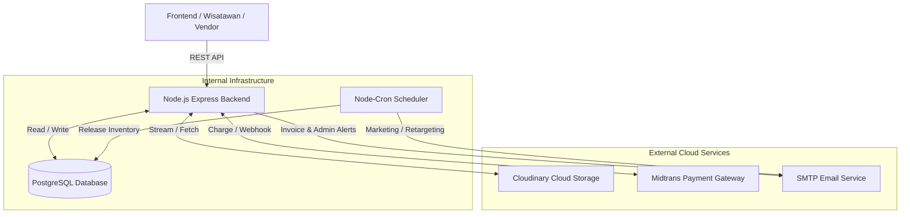

# DIVEXPLORE-3D — Enterprise Backend API

> RESTful API tingkat lanjut (Enterprise-Grade) untuk ekosistem marketplace wisata bahari terintegrasi dengan katalog 3D interaktif. Mengakomodasi arsitektur multi-vendor, inventory locking real-time, virtual ledger, dan audit log keamanan.

---

## 🚀 Enterprise Features (Fitur Unggulan)

- **ACID Transactions & Row-Level Locking**: Menggunakan `transaction.LOCK.UPDATE` untuk mencegah *Double Booking* dan *Race Condition* saat 1.000 user checkout bersamaan.
- **Buffer-Streaming PDF Generator**: Struk PDF (*Invoice*) digenerate murni di memori RAM server menggunakan Buffer, membebaskan server dari tumpukan file fisik.
- **Asynchronous Webhook Processing**: Menangkap notifikasi Midtrans secara *non-blocking* dan mengirimkan Email via *Nodemailer* tanpa memperlambat respon *Payment Gateway*.
- **Automated Email Notifications**: Terintegrasi penuh dengan sistem pengiriman 3 jenis email otomatis di latar belakang: *Invoice PDF* (transaksi lunas), *Marketing/Retargeting* (mengingatkan *abandoned cart*), dan *General Alerts* (notifikasi Admin memverifikasi KYC ke Vendor).
- **Zero-Data Storage (PCI-DSS Compliance)**: Tidak ada satupun kolom *Credit Card* yang disimpan di database lokal.
- **Role-Based Access Control (RBAC)**: Pemisahan akses tingkat tinggi antara Admin, Wisatawan (B2C), dan Vendor (B2B). 
- **Google Identity Services (GIS)**: Autentikasi modern Oauth 2.0 (Google Login) khusus untuk Wisatawan agar minim friksi (*Frictionless*).
- **Automated Virtual Ledger**: Algoritma pembagian dana *Split Payment* otomatis (Komisi Platform vs Pendapatan Bersih Vendor).
- **GDPR Compliance (Pilar 1-5)**: Implementasi *Right to be Forgotten* (Soft Delete), *Audit Logs* aktivitas sensitif, dan sistem *Consent* (Persetujuan Kebijakan).
- **Refund & Withdrawal Workflow**: Alur pengembalian dana wisatawan dan penarikan dana vendor yang aman dengan *Database Lock* dan *Inventory Release* otomatis.
- **Real-Time Inventory Locking**: Penguncian stok otomatis selama 15 menit saat checkout untuk menjamin ketersediaan kuota bagi pembeli.
- **Order Expiration Automation**: Cron Job berjalan setiap 5 menit untuk membatalkan order expired dan melepas stok yang terkunci secara otomatis.
- **ProductAddon Bundling**: Wisatawan dapat memilih layanan tambahan (Sewa Kamera, Guide, Souvenir) dalam satu keranjang belanja terintegrasi.

---

## 🛠️ Tech Stack

| Kategori | Teknologi |
|---|---|
| **Runtime** | Node.js v24 |
| **Framework** | Express.js v5 |
| **Database** | PostgreSQL |
| **Cloud Storage** | Cloudinary (Image, PDF, 3D Assets) |
| **ORM** | Sequelize v6 + Sequelize CLI |
| **Authentication** | JWT (`jsonwebtoken`) + Google OAuth 2.0 (`google-auth-library`) |
| **Input Validation** | Joi |
| **Payment Gateway** | Midtrans API (Snap & Core API) |
| **Document Generator** | PDFKit (Buffer Streaming) |
| **Email Services** | Nodemailer |
| **Task Scheduler** | node-cron (Order Expiration + Marketing Automation) |
| **Logging** | Winston (file + console, level-based) |
| **Security** | Helmet, cors, express-rate-limit, bcrypt |

---

## 🏗️ System Architecture (Arsitektur Sistem)



---

## ⚙️ Setup & Instalasi Lokal

### 1. Prasyarat
- [Node.js v24+](https://nodejs.org/)
- [PostgreSQL](https://www.postgresql.org/) (berjalan lokal / via DBeaver)
- Akun Google Cloud Console (untuk OAuth)
- Akun Midtrans (Sandbox)
- Akun Cloudinary (Free Tier)

### 2. Clone Repository
```bash
git clone <url-repository>
cd Divexplore_3D/Backend
npm install
```

### 3. Konfigurasi Environment Variables
Salin template `.env.example` menjadi `.env`:
```bash
cp .env.example .env
```

### 4. Setup Database
Buka DBeaver atau PostgreSQL CLI, lalu jalankan:
```sql
CREATE DATABASE divexplore_db;
```

Lalu di terminal:
```bash
# Menghapus, membangun ulang, dan mengisi data dummy
npm run db:migrate:undo:all
npm run db:migrate
npm run db:seed
```

### 5. Menyalakan Server
```bash
npm run dev     # Development (auto-restart dengan nodemon)
npm run start   # Production
```

Server berjalan di: **http://localhost:5000**

---

## 🔑 Environment Variables

Lihat file [`.env.example`](.env.example) untuk daftar lengkap. Berikut yang wajib diisi:

| Variable | Contoh | Keterangan |
|---|---|---|
| `DB_USERNAME` | `postgres` | Username PostgreSQL |
| `DB_PASSWORD` | `password` | Password PostgreSQL |
| `DB_HOST` | `127.0.0.1` | Host database |
| `DB_PORT` | `5432` | Port PostgreSQL |
| `DB_NAME` | `divexplore_db` | Nama database |
| `PORT` | `5000` | Port server |
| `NODE_ENV` | `development` | Environment |
| `JWT_SECRET` | *(generate via crypto)* | Secret key JWT — minimal 64 karakter |
| `JWT_EXPIRES_IN` | `7d` | Durasi token |
| `GOOGLE_CLIENT_ID` | *(dari Google Console)* | Untuk Google OAuth |
| `MIDTRANS_SERVER_KEY`| *(dari Midtrans Sandbox)* | Server Key — jangan pernah expose ke frontend |
| `MIDTRANS_CLIENT_KEY`| *(dari Midtrans Sandbox)* | Client Key — aman dikirim ke frontend |
| `MIDTRANS_MERCHANT_ID`| `M3XXXXX` | Merchant ID dari dashboard Midtrans |
| `CLOUDINARY_CLOUD_NAME`| `your_cloud_name` | Konfigurasi media storage Cloudinary |
| `CLOUDINARY_API_KEY`| `your_api_key` | API Key Cloudinary |
| `CLOUDINARY_API_SECRET`| `your_api_secret` | API Secret Cloudinary |
| `SMTP_USER` | `email@gmail.com` | Opsional: Akun Gmail untuk Nodemailer |
| `SMTP_PASS` | `password_app` | Opsional: App Password Gmail untuk Nodemailer |

> ⚠️ **JANGAN** commit file `.env` ke GitHub. File ini sudah di-exclude via `.gitignore`.

---

## 🔐 Cara Generate JWT Secret

```bash
node -e "console.log(require('crypto').randomBytes(64).toString('hex'))"
```
Salin output-nya ke variabel `JWT_SECRET` di file `.env`.

---

## 📜 Scripts

```bash
# Development
npm run dev                   # Jalankan server dengan auto-restart

# Database
npm run db:migrate            # Jalankan semua migration
npm run db:migrate:undo       # Undo migration terakhir
npm run db:migrate:undo:all   # Undo semua migration
npm run db:migrate:status     # Cek status migration

# Seeder
npm run db:seed               # Jalankan semua seeder
npm run db:seed:undo          # Hapus semua data seeder
```

---

## 📁 Struktur Direktori

```
Backend/
├── logs/                         # Log file (auto-generated, tidak di-commit)
│   ├── combined.log              # Semua log level
│   └── error.log                 # Hanya error level
├── src/
│   ├── config/
│   │   └── config.js             # Konfigurasi koneksi DB per environment
│   ├── controllers/              # Handler HTTP request/response
│   │   ├── addonController.js    # CRUD add-on produk
│   │   ├── adminController.js    # Dashboard & laporan admin
│   │   ├── authController.js     # Register, Login, Google OAuth, GDPR
│   │   ├── orderController.js    # Checkout, invoice, riwayat
│   │   ├── productController.js  # CRUD produk & bundling
│   │   ├── promoController.js    # CRUD kode promo
│   │   ├── refundController.js   # Pengajuan & proses refund
│   │   ├── reviewController.js   # Ulasan & rating produk
│   │   ├── sceneController.js    # CRUD scene & hotspot 3D
│   │   ├── vendorController.js   # Profil vendor & KYC
│   │   └── withdrawalController.js # Penarikan dana vendor
│   ├── middlewares/
│   │   ├── authenticate.js       # JWT auth guard + role authorization (RBAC)
│   │   └── errorHandler.js       # Global error handler (catch-all)
│   ├── migrations/               # Migration file Sequelize (26 file, 21 tabel)
│   ├── models/                   # Model Sequelize (ORM mapping ke DB)
│   │   ├── auditlog.js           # Log aktivitas sensitif
│   │   ├── crosssellingrule.js   # Aturan rekomendasi produk terkait
│   │   ├── loyaltypoint.js       # Poin reward wisatawan
│   │   ├── order.js              # Header transaksi
│   │   ├── orderitem.js          # Detail item transaksi
│   │   ├── paymentlog.js         # Log notifikasi Midtrans
│   │   ├── product.js            # Katalog produk wisata
│   │   ├── product3dhotspot.js   # Titik interaktif navigasi & produk di scene
│   │   ├── productaddon.js       # Layanan tambahan produk
│   │   ├── productinventory.js   # Stok & kuota harian
│   │   ├── productvisit.js       # Log kunjungan produk (marketing)
│   │   ├── promo.js              # Kode diskon
│   │   ├── refund.js             # Pengajuan pengembalian dana
│   │   ├── review.js             # Ulasan & rating
│   │   ├── scene.js              # Ruangan virtual 360°
│   │   ├── user.js               # Data user (Wisatawan/Vendor/Admin)
│   │   ├── userconsent.js        # GDPR consent log
│   │   ├── vendor.js             # Profil bisnis vendor
│   │   ├── vendordocument.js     # Dokumen KYC vendor
│   │   ├── virtualledger.js      # Buku kas virtual & komisi
│   │   └── withdrawal.js         # Request penarikan dana
│   ├── routes/                   # Definisi endpoint API
│   │   ├── adminRoutes.js
│   │   ├── authRoutes.js
│   │   ├── orderRoutes.js
│   │   ├── paymentRoutes.js      # Midtrans webhook
│   │   ├── productRoutes.js
│   │   ├── promoRoutes.js
│   │   ├── sceneRoutes.js
│   │   └── vendorRoutes.js
│   ├── seeders/                  # Data dummy untuk development & testing
│   ├── services/                 # Business logic (tidak boleh ada di controller)
│   │   ├── addonService.js       # Logika CRUD add-on
│   │   ├── authService.js        # Logika registrasi, login, JWT
│   │   ├── cronService.js        # Semua Cron Job (expiration + marketing)
│   │   ├── emailService.js       # Nodemailer wrapper
│   │   ├── marketingService.js   # Strategi retargeting & loyalty
│   │   ├── orderService.js       # Checkout engine + Midtrans integration
│   │   ├── reviewService.js      # Ulasan + kalkulasi rating vendor
│   │   ├── sceneService.js       # Logika scene & hotspot
│   │   └── vendorService.js      # Profil & KYC vendor
│   └── utils/
│       └── logger.js             # Winston logger (file + console)
├── .env                          # Environment variables (tidak di-commit)
├── .env.example                  # Template .env untuk tim
├── .gitignore
├── .sequelizerc                  # Konfigurasi path Sequelize CLI
├── package.json
└── server.js                     # Entry point: middleware, routes, cron, graceful shutdown
```

---

## 🗄️ Skema Database (21 Tabel)

| Domain | Tabel |
|---|---|
| **Inti (Core)** | `Users`, `Vendors` |
| **Katalog & 3D** | `Scenes`, `Products`, `Scene3DHotspots`, `ProductAddons`, `CrossSellingRules` |
| **Inventory** | `ProductInventories` |
| **Transaksi** | `Orders`, `OrderItems`, `Promos` |
| **Keuangan & Loyalty**| `VirtualLedgers`, `LoyaltyPoints`, `Refunds`, `Withdrawals` |
| **Keamanan & GDPR** | `AuditLogs`, `UserConsents`, `VendorDocuments` |
| **Log & Marketing** | `PaymentLogs`, `Reviews`, `ProductVisits` |

---

## 🌐 API Testing Guide (Postman Structure)

### 🚦 Standard HTTP Status Codes
Seluruh *endpoint* mematuhi standar RESTful dengan format balasan (Response) JSON terstruktur:
*   `200 OK` / `201 Created` : Operasi berhasil (Format: `{"status": "success", "data": {...}}`).
*   `400 Bad Request` : Input salah / Format file ditolak / Gagal validasi Joi.
*   `401 Unauthorized` : Token JWT tidak ada, kadaluarsa, atau rusak.
*   `403 Forbidden` : Token valid, tapi *Role* tidak memiliki izin akses (RBAC memblokir).
*   `404 Not Found` : Data di tabel atau Rute API tidak ditemukan.
*   `413 Payload Too Large` : File *upload* melebihi batas ukuran (Maks 5MB / 10MB / 30MB).
*   `500 Internal Server Error` : Terjadi kendala teknis pada server atau *database*.

### ⚙️ Postman Environment & Automation Scripts

Untuk mempermudah testing dan menghindari *copy-paste* token manual, silakan buat **Environment** di Postman dengan variabel berikut (Atau biarkan script Test Postman yang mengisinya secara otomatis):

| Variable | Initial Value | Keterangan |
|---|---|---|
| `base_url` | `http://localhost:5000` | URL utama API |
| `admin_token` | *(kosong)* | Terisi otomatis saat Admin login |
| `vendor_token` | *(kosong)* | Token aktif yang mewakili Vendor yang terakhir login |
| `vendor_v1_token` | *(kosong)* | Token khusus Vendor V1 (Aktivitas) |
| `vendor_v2_token` | *(kosong)* | Token khusus Vendor V2 (Peralatan) |
| `vendor_v3_token` | *(kosong)* | Token khusus Vendor V3 (Homestay) |
| `vendor_v4_token` | *(kosong)* | Token khusus Vendor V4 (Kuliner) |
| `vendor_v5_token` | *(kosong)* | Token khusus Vendor V5 (Fotografi) |
| `wisatawan_token` | *(kosong)* | Terisi otomatis saat Wisatawan login |
| `vendor_id` | *(kosong)* | Terisi otomatis saat vendor inisialisasi profil |

💡 **Tips Script Otomatisasi (Tests Tab)**
Dalam Postman Collection yang disediakan (`Divexplore_3D_Collection.json`), sudah terpasang script otomatis di tab **Tests** pada request Auth. Contohnya pada saat Login Vendor:
```javascript
const res = pm.response.json();
if (res.status === "success") {
    pm.environment.set("vendor_v1_token", res.data.token);
    pm.environment.set("vendor_token", res.data.token); // Set menjadi vendor yang aktif secara global
    console.log("Token vendor_v1_token berhasil disimpan!");
}
```

### 🔐 Tips Setup Authorization (Sangat Penting)
Agar tidak perlu memasukkan token satu per satu di setiap request, atur **Authorization** pada tingkat **Folder**:
1. Klik Kanan pada folder Postman (misal: `02 - Vendor`).
2. Pilih tab **Authorization**.
3. Type: pilih **Bearer Token**.
4. Token: ketik `{{vendor_token}}` (Atau `{{admin_token}}` / `{{wisatawan_token}}` sesuai foldernya).
5. Pada semua *request* di dalam folder tersebut, pastikan Authorization-nya berstatus **Inherit auth from parent**.

---

Berikut adalah detail endpoint lengkap sesuai urutan folder pengujian di Postman (Berdasarkan `Divexplore_3D_Collection.json`):

### **📂 00 - Health Check**
| Nama Request | Method | Endpoint | Deskripsi | Auth / Role |
|---|---|---|---|---|
| Ping Server | `GET` | `/` | Health check server aktif | — |
| Test 404 Route | `GET` | `/any-route` | Tes Error Handler (404 Not Found) | — |

### **📂 01 - Auth**
| Nama Request | Method | Endpoint | Deskripsi | Auth / Role |
|---|---|---|---|---|
| [V1-V5] Register Vendor | `POST` | `/api/auth/register` | 5 Request Registrasi manual untuk 5 tipe vendor | — |
| Google Login (Wisatawan) | `POST` | `/api/auth/google` | Login via Google (Wisatawan) | — |
| Login Manual Admin | `POST` | `/api/auth/login` | Login manual Admin | — |
| [V1-V5] Login Manual Vendor | `POST` | `/api/auth/login` | 5 Request Login manual untuk 5 tipe vendor | — |
| Get My Profile | `GET` | `/api/auth/me` | Lihat profil user yang sedang aktif | ✅ All |
| Update Profile | `PUT` | `/api/auth/me` | Update profil (Telepon, Alamat, Foto) | ✅ All |
| Get Loyalty Points | `GET` | `/api/auth/me/points` | Lihat saldo loyalty points | ✅ Wisatawan |
| Submit GDPR Consent | `POST` | `/api/auth/consent` | Pencatatan persetujuan privasi privasi | ✅ All |
| Soft Delete Account | `DELETE` | `/api/auth/account` | Hapus akun (Soft Delete - GDPR) | ✅ All |

### **📂 02 - Vendor**
| Nama Request | Method | Endpoint | Deskripsi | Auth / Role |
|---|---|---|---|---|
| [V1-V5] Init Profil Vendor | `POST` | `/api/vendors` | 5 Request Inisialisasi profil bisnis untuk 5 vendor | ✅ Vendor |
| Get My Vendor Profile | `GET` | `/api/vendors/me` | Lihat profil bisnis sendiri | ✅ Vendor |
| Update Vendor Profile | `PUT` | `/api/vendors/me` | Update data bisnis/toko | ✅ Vendor |
| Get Public Vendor Profile | `GET` | `/api/vendors/:id` | Lihat profil publik vendor | — |
| Upload KYC Document | `POST` | `/api/vendors/me/documents` | Upload dokumen KYC (KTP/NIB) | ✅ Vendor |
| Get KYC Status | `GET` | `/api/vendors/me/documents` | Lihat status verifikasi dokumen | ✅ Vendor |
| Get Vendor Ledgers | `GET` | `/api/vendors/me/ledgers` | Buku kas & riwayat komisi vendor | ✅ Vendor |

### **📂 03 - Admin**
| Nama Request | Method | Endpoint | Deskripsi | Auth / Role |
|---|---|---|---|---|
| Get All Vendors | `GET` | `/api/admin/vendors` | Lihat daftar seluruh vendor | ✅ Admin |
| Approve/Reject KYC | `PUT` | `/api/admin/vendors/:id/kyc` | Approve/Reject dokumen KYC vendor | ✅ Admin |
| Get GMV Report | `GET` | `/api/admin/reports/gmv` | Analisis omzet (GMV Tracker) | ✅ Admin |
| Get Abandoned Carts | `GET` | `/api/admin/abandoned-carts` | Daftar transaksi tertunda | ✅ Admin |
| Trigger Marketing Cron | `POST` | `/api/admin/marketing/trigger` | Pemicu strategi marketing otomatis | ✅ Admin |
| Get All Refunds | `GET` | `/api/admin/refunds` | Lihat semua pengajuan refund | ✅ Admin |
| Process Refund | `PUT` | `/api/admin/refunds/:id` | Approve/Reject permintaan refund | ✅ Admin |
| Get All Withdrawals | `GET` | `/api/admin/withdrawals` | Lihat semua pengajuan penarikan | ✅ Admin |
| Process Withdrawal | `PUT` | `/api/admin/withdrawals/:id` | Proses transfer dana ke vendor | ✅ Admin |

### **📂 04 - Scenes & Hotspots (3D)**
| Nama Request | Method | Endpoint | Deskripsi | Auth / Role |
|---|---|---|---|---|
| Get All Scenes | `GET` | `/api/scenes` | Daftar semua ruangan 3D | — |
| Create 3D Scene | `POST` | `/api/scenes` | Buat scene 3D baru | ✅ Admin |
| Update 3D Scene | `PUT` | `/api/scenes/:id` | Update data scene 3D | ✅ Admin |
| Delete 3D Scene | `DELETE` | `/api/scenes/:id` | Hapus scene 3D | ✅ Admin |
| Add Scene Hotspot | `POST` | `/api/scenes/:id/hotspots` | Tambah hotspot produk/navigasi ke scene | ✅ Admin |

### **📂 05 - Products**
| Nama Request | Method | Endpoint | Deskripsi | Auth / Role |
|---|---|---|---|---|
| Get Public Products | `GET` | `/api/products` | Katalog produk publik | — |
| Get Product Detail | `GET` | `/api/products/:id` | Detail produk + ulasan + metadata 3D | — |
| [V1-V5] Buat Produk | `POST` | `/api/products` | Berbagai request pembuatan katalog produk untuk tiap vendor | ✅ Vendor |
| Update Product | `PUT` | `/api/products/:id` | Vendor update data produk | ✅ Vendor |
| Delete Product | `DELETE` | `/api/products/:id` | Vendor menghapus produk | ✅ Vendor |
| Add Bundling Rule | `POST` | `/api/products/:id/bundling` | Menambah aturan bundling produk | ✅ Vendor |
| Record Product Visit | `POST` | `/api/products/:id/visit` | Mencatat kunjungan produk | ✅ All |
| Get Product Addons | `GET` | `/api/products/:productId/addons` | Lihat daftar add-on produk | — |
| Create Product Addon | `POST` | `/api/products/:productId/addons` | Vendor membuat add-on baru | ✅ Vendor |
| Update Product Addon | `PUT` | `/api/products/:productId/addons/:addonId` | Vendor update add-on | ✅ Vendor |
| Delete Product Addon | `DELETE` | `/api/products/:productId/addons/:addonId` | Vendor hapus add-on | ✅ Vendor |
| Get Product Reviews | `GET` | `/api/products/:productId/reviews` | Lihat ulasan publik produk | — |

### **📂 06 - Inventory**
| Nama Request | Method | Endpoint | Deskripsi | Auth / Role |
|---|---|---|---|---|
| Manage Daily Inventory | `POST` | `/api/vendors/me/products/:id/inventory` | Atur kuota stok per tanggal | ✅ Vendor |

### **📂 07 - Promos**
| Nama Request | Method | Endpoint | Deskripsi | Auth / Role |
|---|---|---|---|---|
| Get Active Promos | `GET` | `/api/promos` | Melihat daftar promo yang aktif | — |
| Create Promo Code | `POST` | `/api/promos` | Admin membuat kode diskon baru | ✅ Admin |
| Update Promo Code | `PUT` | `/api/promos/:id` | Admin memperbarui promo | ✅ Admin |
| Delete Promo Code | `DELETE` | `/api/promos/:id` | Admin menghapus promo | ✅ Admin |

### **📂 08 - Orders**
| Nama Request | Method | Endpoint | Deskripsi | Auth / Role |
|---|---|---|---|---|
| Checkout (Midtrans Snap) | `POST` | `/api/orders` | Checkout & Snap Midtrans (Inventory Locking) | ✅ Wisatawan |
| Get My Order History | `GET` | `/api/orders/me` | Riwayat pesanan saya | ✅ Wisatawan |
| Download Invoice PDF | `GET` | `/api/orders/:id/invoice` | Download Struk PDF otomatis | ✅ Wisatawan |
| Request Order Refund | `POST` | `/api/orders/:id/refund` | Ajukan pengembalian dana (Refund) | ✅ Wisatawan |
| Check Refund Status | `GET` | `/api/orders/:id/refund-status` | Cek status pengajuan refund | ✅ Wisatawan |
| Submit Order Review | `POST` | `/api/orders/:orderId/reviews` | Beri rating bintang 1-5 | ✅ Wisatawan |
| Get Vendor Incoming Orders | `GET` | `/api/orders/vendor` | Lihat pesanan masuk (Vendor) | ✅ Vendor |
| Get All Orders (Admin) | `GET` | `/api/orders/admin` | Lihat seluruh pesanan (Admin) | ✅ Admin |

### **📂 09 - Payments**
| Nama Request | Method | Endpoint | Deskripsi | Auth / Role |
|---|---|---|---|---|
| Midtrans Webhook Callback | `POST` | `/api/webhooks/midtrans` | Webhook update status bayar dari Midtrans | — |

### **📂 10 - Reviews**
| Nama Request | Method | Endpoint | Deskripsi | Auth / Role |
|---|---|---|---|---|
| Submit Review | `POST` | `/api/orders/:orderId/reviews` | Beri rating bintang 1-5 (via Orders) | ✅ Wisatawan |
| Get Product Reviews | `GET` | `/api/products/:productId/reviews` | Lihat ulasan publik produk | — |

### **📂 11 - Vendor Dashboard**
| Nama Request | Method | Endpoint | Deskripsi | Auth / Role |
|---|---|---|---|---|
| View Commission Ledger | `GET` | `/api/vendors/me/ledgers` | Buku kas & riwayat komisi vendor | ✅ Vendor |
| Request Fund Withdrawal | `POST` | `/api/vendors/me/withdrawals` | Request tarik dana ke rekening bank | ✅ Vendor |
| View Withdrawal History | `GET` | `/api/vendors/me/withdrawals` | Riwayat & status penarikan dana | ✅ Vendor |
| Set Cross-Selling Rule | `POST` | `/api/vendors/me/products/:id/cross-selling` | Atur rekomendasi produk terkait | ✅ Vendor |

### **📂 12 - Media Uploads (Cloudinary)**
| Nama Request | Method | Endpoint | Deskripsi | Auth / Role |
|---|---|---|---|---|
| Upload Foto Profil | `POST` | `/api/upload/profile` | Upload foto profil User/Vendor (Max 5MB) | ✅ All |
| Upload Foto Produk | `POST` | `/api/upload/product` | Upload logo & foto produk (Max 5MB) | ✅ Vendor |
| Upload Dokumen KYC | `POST` | `/api/upload/document` | Upload dokumen verifikasi (Max 10MB) | ✅ Vendor |
| Upload Panorama 360| `POST` | `/api/upload/panorama` | Upload background 360° Scene (Max 10MB) | ✅ Admin |
| Upload 3D Asset | `POST` | `/api/upload/3d-model` | Upload file mentah .glb/.gltf (Max 30MB) | ✅ Admin |

---

## 🔄 Alur Bisnis Utama (Business Flow)

### Sampling Flow (Target Presentasi Dosen)
```
[Wisatawan]
    ↓
  1. Login Google OAuth → Dapat JWT Token
    ↓
  2. Lihat Scene 3D → GET /api/scenes/:id (koordinat hotspot)
    ↓
  3. Klik Produk di Hotspot → GET /api/products/:id + add-ons
    ↓
  4. Checkout (POST /api/orders)
      → Inventory LOCK 15 menit
      → Add-on harga dijumlah
      → Audit Log dicatat
    ↓
  5. Bayar via Midtrans Snap (snap_token dari response)
    ↓
  6. Midtrans Webhook → POST /api/webhooks/midtrans
      → Signature SHA512 divalidasi
      → Status Order → "paid"
      → Inventory "locked" → "sold"
      → VirtualLedger dibuat (komisi terhitung)
      → Loyalty Points diberikan
      → Invoice PDF dikirim via Email
```

### Alur Admin
```
[Admin] → Approve KYC Vendor → Vendor bisa berjualan
[Admin] → Review Refund Request → Approve → Stok otomatis kembali
[Admin] → Review Withdrawal → Transfer manual → Konfirmasi di sistem
```

### Alur Otomasi (Cron Jobs)
```
Setiap 5 menit  → Batalkan order expired + release inventory
Setiap 30 menit → Kirim email reminder bayar (wisatawan pending)
Setiap 09.00    → Kirim penawaran loyalty point (wisatawan aktif)
Setiap 10.00    → Kirim retargeting email (berdasarkan riwayat kunjungan)
```

---


---

## 🔑 Aturan Autentikasi (Authentication Rules)

- **Wisatawan**: DILARANG mendaftar secara manual. Hanya diizinkan masuk melalui **Google Login** (`POST /api/auth/google`).
- **Vendor**: Mendaftar secara manual melalui `POST /api/auth/register` (Otomatis ditandai sebagai role `vendor`). Wajib melampirkan dokumen KYC setelah berhasil login.
- **Admin**: Hanya dibuat secara langsung di tingkat Database (via Seeder).

---

## 👨‍💻 Kontributor

| Nama | NIM | Role |
|---|---|---|
| Alfin Himawan Santosa | 24051130081 | Backend Developer & Database |
| ⁠Muhammad Rafli Dharmanda Andoyo | 24051130087 | Backend Developer & Database |
| Pramudya Tien Meylandri | 24051130088 | Backend Developer & Database |
| Naufal Hanif Ramadhan Darwis | 24051130106 | Backend Developer & Database |
| Muhammad Zaidaan | 24051130110 | Backend Developer & Database |

---

<p align="center">
  <b>Universitas Negeri Yogyakarta, 2026</b><br>
  <i>Proyek Manajemen — Minimum Viable Product (MVP)</i>
</p>
